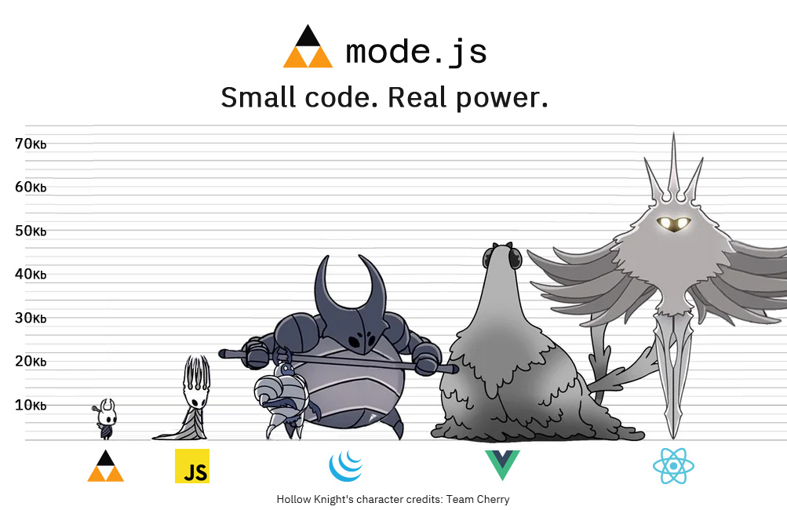

# Mode JS

**Mode JS** is a low-level interaction engine for the web.
It belongs to the **Microdom** ecosystem.

It does not provide widgets, components, or behaviors.
It provides a way to reason about **movement**, **intent**, and **structure**.

Mode JS is designed for developers who want to *build* interactions,
not configure them.

---

## What Mode JS is


- A low-level interaction primitive
- Pointer- and touch-aware
- Minimal by design
- Framework-agnostic
- DOM-friendly
- Data-binding ready

Mode JS helps you express *how things move* — not *what they are*.

---

## What Mode JS is not

- ❌ A WebComponents library
- ❌ A UI framework
- ❌ A state machine
- ❌ A collection of ready-made behaviors

Those things can be **built with Mode JS**, but they do not belong inside it.

---
### Install

```bash
npm install @microdom/mode
```
**Usage**
```bash
import µ from "@microdom/mode"
// or: import { µ } from "@microdom/mode"
```

**CDN**
```html
<script src="https://cdn.jsdelivr.net/gh/microdom/mode.js/dist/mode.min.js"></script>
<script>
  µ("body", { /* ... */ })
</script>
```


## Why Mode JS exists

Most interaction libraries:
- abstract too early
- hide intent behind state
- grow uncontrollably
- break at the edges (touch, empty states, nested structures)

Mode JS takes a different approach:

> **Movement first.  
> Intent is explicit.  
> Structure matters more than features.**

---

## Why not X?

Modern UI stacks often require tens of kilobytes of code
to express a simple interaction.

Mode JS asks a different question:

> *How much code do you actually need  
> to make something feel right?*

```md
A complete multi-list sortable with touch support
can be built in **~6 KB total**.
```

Read the full comparison in  
[`docs/why-not-x.md`](docs/why-not-x.md).

---

### Code weight in perspective
>Characters © Team Cherry



> The little one can rule the town.

---

## Repository structure

If you’re looking for examples, start in **/demos**.  
If you’re looking for ideas, start in **/docs**.

---

## Demos

- **Sortable (multi-list + touch)**  
  A complete sortable interaction built with ~6 KB of code.
  Demonstrates intent gating, empty container handling, and cross-list movement.

Each demo is intentionally **self-contained**.
They are not plugins — they are *proofs of thought*.

---

## Philosophy

Mode JS is opinionated:

> “If an interaction cannot be expressed simply,
> the abstraction is probably wrong.”

Read more in [`docs/philosophy.md`](docs/philosophy.md).

---

## License

MIT
